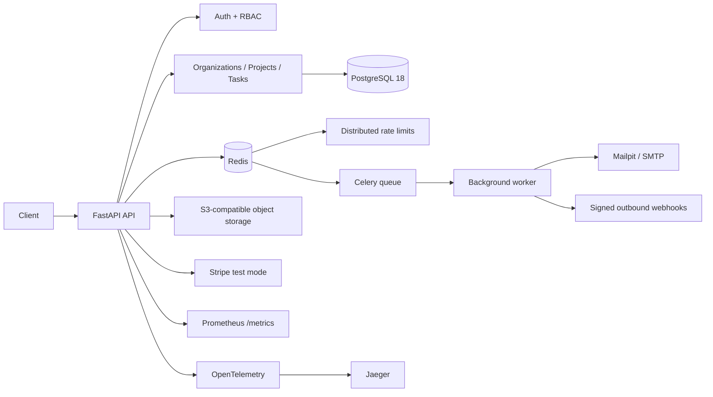
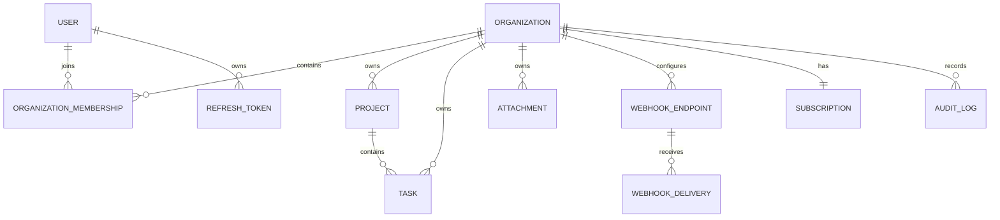

# TenantFlow API

[](https://github.com/snakyv/tenantflow-api/actions/workflows/ci.yml)
[](https://github.com/snakyv/tenantflow-api/actions/workflows/codeql.yml)
[](https://github.com/snakyv/tenantflow-api/releases/latest)
[](https://www.python.org/)
[](LICENSE)

Production-oriented multi-tenant SaaS backend built with FastAPI, PostgreSQL, Redis, async SQLAlchemy, Stripe test mode and OpenTelemetry.

TenantFlow is intentionally built as a modular monolith rather than a collection of artificial microservices. The project focuses on the backend concerns that usually appear after CRUD is no longer the hard part: tenant isolation, authorization, transaction boundaries, request idempotency, durable background work, signed webhooks, object storage, billing synchronization, observability and automated integration testing.

## Release status

**Latest stable release: `v1.0.0`**

The current release has been validated on Windows 11 with Python 3.12 and Docker Desktop. The latest full release gate completed with:

- **61 passing tests** across unit, security, integration and E2E suites;
- **64.37% application coverage**, above the configured 60% floor;
- **Ruff passed**;
- **mypy passed across 92 source files**;
- **`pip-audit` reported no known vulnerabilities** in auditable dependencies;
- **Docker image build passed** on `python:3.12-slim`;
- **Stripe Sandbox E2E passed**, including Checkout, signed webhook processing and subscription synchronization;
- **GitHub Actions CI and CodeQL are enabled and passing** for the validated release.

See [`VALIDATION.md`](VALIDATION.md) for the exact validation record.


## Engineering highlights

- **Multi-tenancy with explicit organization context.** A user can belong to multiple organizations. Organization-owned resources are always queried with `organization_id`; knowing another tenant's UUID is not sufficient to access it.
- **RBAC with a visible permission matrix.** Owner, admin, member and viewer roles are translated into explicit permissions rather than scattered router-level conditionals.
- **Short-lived JWT access tokens and rotating refresh tokens.** Refresh tokens are random secrets stored only as SHA-256 fingerprints and are revoked on rotation.
- **PostgreSQL-backed idempotency.** Side-effecting operations can use `Idempotency-Key`; uniqueness and row locking protect against duplicate work under concurrent retries.
- **Redis-backed distributed rate limiting.** Login throttling uses an atomic token bucket shared across API instances instead of process-local counters.
- **Durable Celery jobs.** Invitation email and outbound webhook work is sent through Redis-backed Celery workers instead of FastAPI `BackgroundTasks`.
- **Signed outbound webhooks.** Deliveries use per-endpoint secrets, HMAC-SHA256 signatures, retry state, delivery history and production SSRF guards for non-public targets.
- **S3-compatible file storage.** PostgreSQL stores metadata while object bytes live in MinIO locally or another S3-compatible store in deployment.
- **Stripe test-mode billing.** Checkout creation uses Stripe idempotency keys; incoming events require Stripe signatures and are deduplicated by event ID.
- **Observability.** Prometheus metrics, request IDs, structured production logs and optional OpenTelemetry tracing to Jaeger.
- **Quality gates.** Ruff, mypy, pytest, dependency auditing, Alembic migrations, Docker image build and PostgreSQL/Redis integration tests run in GitHub Actions.

## Architecture



The implementation is a **modular monolith**. PostgreSQL is the durable source of truth; Redis is used for coordination and background infrastructure, not as a second primary database.

## Core stack

| Area | Technology |
|---|---|
| Runtime | Python 3.12 |
| API | FastAPI 0.141.1 |
| Validation | Pydantic v2 |
| Database | PostgreSQL 18.6 |
| ORM | SQLAlchemy 2.0.52 async + asyncpg 0.31.0 |
| Migrations | Alembic 1.19.1 |
| Coordination | Redis 8.10 |
| Jobs | Celery 5.6 |
| Storage | S3-compatible API / MinIO locally |
| Billing | Stripe 15.5.0, Sandbox/test mode |
| Metrics | Prometheus |
| Tracing | OpenTelemetry + Jaeger 2 |
| QA | pytest, Ruff, mypy, pip-audit |
| CI | GitHub Actions |

## Domain model



The actual schema also contains invitations, idempotency records and processed Stripe events.

## RBAC matrix

| Permission | Owner | Admin | Member | Viewer |
|---|:---:|:---:|:---:|:---:|
| Read projects/tasks | ✓ | ✓ | ✓ | ✓ |
| Create/update projects/tasks | ✓ | ✓ | ✓ | — |
| Delete projects | ✓ | ✓ | — | — |
| Manage members | ✓ | ✓ | — | — |
| Manage webhooks | ✓ | ✓ | — | — |
| Read audit log | ✓ | ✓ | — | — |
| Manage billing | ✓ | — | — | — |
| Manage organization | ✓ | — | — | — |

## Local development on Windows 11 + PyCharm

The intended workflow is deliberately simple:

```text
PyCharm 2026.1.4 + local Python 3.12
                |
             FastAPI
                |
         Docker Desktop
      /      |      |      \
PostgreSQL Redis  MinIO   Mailpit
```

PostgreSQL is **not** installed as a Windows service.

### 1. Audit the machine

From PowerShell:

```powershell
Set-ExecutionPolicy -Scope Process Bypass
.\scripts\check_windows.ps1
```

The script checks Python, Git, Docker Desktop, Docker Compose and the ports used by the development stack.

### 2. Bootstrap automatically

```powershell
.\scripts\bootstrap_windows.ps1
```

Or run the steps manually:

```powershell
py -3.12 -m venv .venv
.\.venv\Scripts\Activate.ps1
python -m pip install --upgrade pip
pip install -e ".[dev]"
Copy-Item .env.example .env
docker compose -f compose.dev.yml up -d
alembic upgrade head
python scripts/init_minio.py
```

Generate real local secrets before testing authentication:

```powershell
python -c "import secrets; print(secrets.token_urlsafe(48))"
```

Use separate values for `JWT_SECRET` and `WEBHOOK_ENCRYPTION_KEY` in `.env`.

### PostgreSQL 18 note

PostgreSQL 18's official Docker image stores clusters under a version-specific path and declares `/var/lib/postgresql` as the volume root. The compose files therefore mount the named volume at `/var/lib/postgresql`, not the pre-18 `/var/lib/postgresql/data` path.

### 3. Configure PyCharm

1. Open the repository root in PyCharm 2026.1.4.
2. Select `.venv\Scripts\python.exe` as the project interpreter.
3. Create a Python run configuration for module `uvicorn`.
4. Parameters: `app.main:app --reload --host 127.0.0.1 --port 8000`.
5. Working directory: repository root.

Useful URLs:

- OpenAPI UI: `http://127.0.0.1:8000/docs`
- Liveness: `http://127.0.0.1:8000/health/live`
- Readiness: `http://127.0.0.1:8000/health/ready`
- Mailpit: `http://127.0.0.1:8025`
- MinIO console: `http://127.0.0.1:9001`

Optional observability stack:

```powershell
docker compose -f compose.dev.yml --profile observability up -d
```

Then use Prometheus on port `9090` and Jaeger on port `16686`.

### Full reproducible Docker stack

For a reviewer who does not use PyCharm, the complete application stack can be started from containers:

```powershell
Copy-Item .env.example .env
docker compose up --build
```

The full compose file includes one-shot migration and MinIO bucket-initialization services before the API and worker start. It deliberately separates the internal MinIO endpoint (`http://minio:9000`) from the browser-visible pre-signed URL endpoint (`http://localhost:9000`), so URLs generated inside the API container remain usable from the host. Add the optional observability services with:

```powershell
docker compose --profile observability up --build
```

## Dependency reproducibility

Direct runtime and development dependencies are pinned in `pyproject.toml`. When intentionally refreshing the dependency graph, generate and review the transitive lockfile with:

```powershell
.\scripts\refresh_lock.ps1
```

If `uv.lock` changes, review it and commit it together with the dependency change rather than generating it implicitly during application startup.

## Migrations

Schema changes go through Alembic. Application startup never calls `Base.metadata.create_all()` as a production migration mechanism.

```bash
alembic upgrade head
alembic revision --autogenerate -m "describe schema change"
```

Autogenerated revisions are candidates and should be reviewed before commit.

## API workflow

Register a user:

```bash
curl -X POST http://127.0.0.1:8000/api/v1/auth/register \
  -H "Content-Type: application/json" \
  -d '{"email":"owner@example.com","password":"LongEnoughPassword!123","full_name":"Owner"}'
```

Obtain an OAuth2-compatible bearer token:

```bash
curl -X POST http://127.0.0.1:8000/api/v1/auth/token \
  -H "Content-Type: application/x-www-form-urlencoded" \
  --data-urlencode "username=owner@example.com" \
  --data-urlencode "password=LongEnoughPassword!123"
```

The API also exposes a JSON login endpoint for non-OAuth clients.

Log in, then create an organization using an idempotency key:

```bash
curl -X POST http://127.0.0.1:8000/api/v1/organizations \
  -H "Authorization: Bearer <ACCESS_TOKEN>" \
  -H "Idempotency-Key: organization-demo-001" \
  -H "Content-Type: application/json" \
  -d '{"name":"Acme","slug":"acme"}'
```

Repeating the same request with the same key and payload returns the original organization. Reusing the key with a different payload produces a conflict.

## Multi-tenant security model

Every organization-owned endpoint contains the organization context in the URL, for example:

```text
/api/v1/organizations/{organization_id}/projects
/api/v1/organizations/{organization_id}/projects/{project_id}
/api/v1/organizations/{organization_id}/tasks
```

The JWT identifies the **user**, not a permanent current organization. Membership is resolved server-side for every tenant request. Resource queries include both resource ID and organization ID. A user who is not a member receives a not-found response so the API does not reveal whether another tenant exists.

`tests/integration/test_api_workflow.py` contains an explicit cross-tenant access scenario.

## Idempotency

Organization creation, invitation creation and billing checkout use the same database-backed idempotency primitive:

1. Canonical JSON is hashed.
2. `(scope, key)` has a PostgreSQL unique constraint.
3. `INSERT ... ON CONFLICT DO NOTHING` determines which request owns the key.
4. A conflicting request locks and reads the existing row.
5. Same key + different payload is rejected.
6. A completed request can be replayed without creating a duplicate organization.

This protects application state independently of client retry behavior. Billing checkout also forwards the idempotency key to Stripe so both the local API boundary and the external payment request are retry-safe.

## Rate limiting

Login throttling uses an atomic Redis-backed token bucket. Redis provides the shared clock and Lua performs refill plus consumption in one server-side operation, so multiple API replicas enforce the same quota. The limiter returns remaining capacity and retry time, and the API can return `429 Too Many Requests` with `Retry-After`.

## Background jobs

Celery 5.6 uses Redis as broker/backend. Jobs are configured with late acknowledgement and worker prefetch `1` to make failure behavior explicit.

Current jobs include:

- invitation email delivery to Mailpit in local development;
- outbound webhook delivery with retry/backoff behavior;
- maintenance cleanup for expired idempotency, refresh-token and invitation records.

The API deliberately treats broker publication as part of the write use case. If the broker cannot accept the job, the request transaction is rolled back rather than silently persisting work that will never be dispatched. A worker can briefly race the transaction commit and therefore treats an invisible row as retryable. This is a documented trade-off, **not** an exactly-once claim; see [ADR 0005](docs/adr/0005-background-publish-boundary.md).

## Outbound webhooks

Organizations can register endpoints for supported events such as:

```text
project.created
project.updated
project.deleted
task.created
task.updated
task.completed
task.deleted
member.invited
```

A signing secret is shown only when the endpoint is created. At rest, the reversible copy is encrypted using a separate application encryption secret; a hash is stored for identity checks. Deliveries include an event UUID and HMAC-SHA256 signature.

Retries use exponential backoff and finish in a dead state after the configured attempt limit. Production mode also rejects webhook targets that resolve to loopback, private, link-local or other non-public addresses; the target is checked again before delivery. Local development can opt into private targets with `WEBHOOK_ALLOW_PRIVATE_TARGETS=true`.

## File storage

Clients request a pre-signed upload URL. The API validates content type and declared size, creates an unpredictable tenant-scoped object key and persists only metadata in PostgreSQL. Object bytes remain in S3-compatible storage.

The default development policy allows PDF, JPEG, PNG, plain text and CSV files up to 20 MiB.

## Stripe test-mode billing

Stripe integration is intentionally disabled until test credentials and Price IDs are supplied in `.env`.

The checkout flow:

- requires owner-level billing permission;
- passes an idempotency key to Stripe POST operations;
- adds organization metadata to both Checkout Session and subscription data.

### Validated Sandbox E2E

The complete external billing path has been exercised against Stripe Sandbox:

```text
TenantFlow API
    -> Stripe Checkout
    -> Stripe subscription
    -> signed Stripe webhook
    -> TenantFlow webhook handler
    -> PostgreSQL subscription state
```

The validated organization state changed from `free / inactive` to `pro / active`, and the observed Stripe webhook deliveries returned `204 No Content`. No live-mode Stripe credentials or real card data were used.

The webhook flow:

- reads the raw HTTP request body;
- verifies `Stripe-Signature` using Stripe's SDK;
- stores each Stripe event ID under a unique constraint;
- ignores already-processed events;
- synchronizes subscription state in PostgreSQL.

Never place live Stripe secrets or real card data in this repository.

## Observability

`/metrics` exposes Prometheus metrics for HTTP activity and background delivery outcomes. Production logs use JSON and every response carries an `X-Request-ID` correlation identifier.

When `OTEL_ENABLED=true`, the application initializes the OpenTelemetry SDK and instrumentation for FastAPI, SQLAlchemy, HTTPX and Redis. The optional development profile starts Jaeger 2.20 as an OTLP-compatible trace backend.

## Testing

Fast feedback without infrastructure:

```bash
pytest -m "not integration"
```

Full integration suite with PostgreSQL, Redis, MinIO and Mailpit:

```bash
docker compose -f compose.dev.yml up -d --wait postgres redis minio mailpit
alembic upgrade head
python scripts/init_minio.py
APP_ENV=test RUN_INTEGRATION=1 pytest
```

PowerShell equivalent:

```powershell
docker compose -f compose.dev.yml up -d --wait postgres redis minio mailpit
alembic upgrade head
python scripts/init_minio.py
$env:APP_ENV = "test"
$env:RUN_INTEGRATION = "1"
pytest
Remove-Item Env:RUN_INTEGRATION -ErrorAction SilentlyContinue
Remove-Item Env:APP_ENV -ErrorAction SilentlyContinue
```

The integration suite intentionally uses PostgreSQL, Redis, MinIO and Mailpit. It does not silently replace PostgreSQL with SQLite or infrastructure services with in-memory stand-ins.

Key tested behavior includes password hashing, JWT parsing, refresh rotation, RBAC, HMAC webhook signatures, storage validation, idempotency hashing, health/OpenAPI behavior, idempotent organization creation, concurrent duplicate protection, cross-tenant isolation, database-level tenant constraints, invitation identity binding, Stripe event deduplication, Redis rate limiting, MinIO/Mailpit infrastructure integration and a complete owner → organization → project → task → audit E2E workflow.

## Quality commands

```bash
ruff check .
mypy app tests
pytest --cov=app --cov-report=term-missing
pip-audit
docker build -t tenantflow-api .
```

On the target Windows 11 / Python 3.12 machine, the complete local release gate is automated by:

```powershell
.\scripts\validate_release.ps1
```

GitHub Actions is configured to perform those gates using Python 3.12 with PostgreSQL and Redis service containers. The initial CI coverage floor is deliberately set to **60%** rather than manufacturing low-value tests for a vanity number. Raise the threshold as billing, storage and worker integration tests expand. A separate CodeQL workflow performs security-oriented static analysis, and Dependabot watches Python, Docker and GitHub Actions dependencies.

The latest full local release gate on Windows 11 / Python 3.12 / Docker Desktop passed **61 tests** with **64.37% coverage**, passed Ruff and mypy across **92 source files**, reported no known vulnerabilities in auditable dependencies, and built the Docker image successfully. A real Stripe Sandbox end-to-end checkout flow also passed, including signed webhook processing and synchronization of the subscription state in PostgreSQL. GitHub Actions CI and CodeQL are enabled and passing for the validated `v1.0.0` release. See [`VALIDATION.md`](VALIDATION.md) for the exact record.

## Engineering decisions

Architecture Decision Records live under [`docs/adr`](docs/adr):

- modular monolith instead of artificial microservices;
- explicit organization context for tenant isolation;
- PostgreSQL as the durable source of truth;
- durable external background jobs instead of in-process background work;
- the explicit PostgreSQL/Redis publish boundary and the future transactional-outbox path.

## Deployment status

No paid cloud infrastructure is provisioned by this repository. `v1.0.0` is a validated local/Docker/CI release rather than a claim of a production cloud deployment. The application is containerized and cloud-portable, but a public deployment should be added only after selecting a provider, configuring managed PostgreSQL/Redis/object storage, production secrets and TLS, and verifying the complete definition of done. This avoids publishing a fake demo URL or silently creating billable resources.

## Security

See [`SECURITY.md`](SECURITY.md) and the scoped [`threat model`](docs/threat-model.md). `.env` is ignored. `.env.example` contains development placeholders only. Production startup rejects default/reused application secrets and requires private webhook targets to be disabled. Do not commit credentials, access tokens, webhook secrets or customer data.

## License

MIT. See [`LICENSE`](LICENSE).
