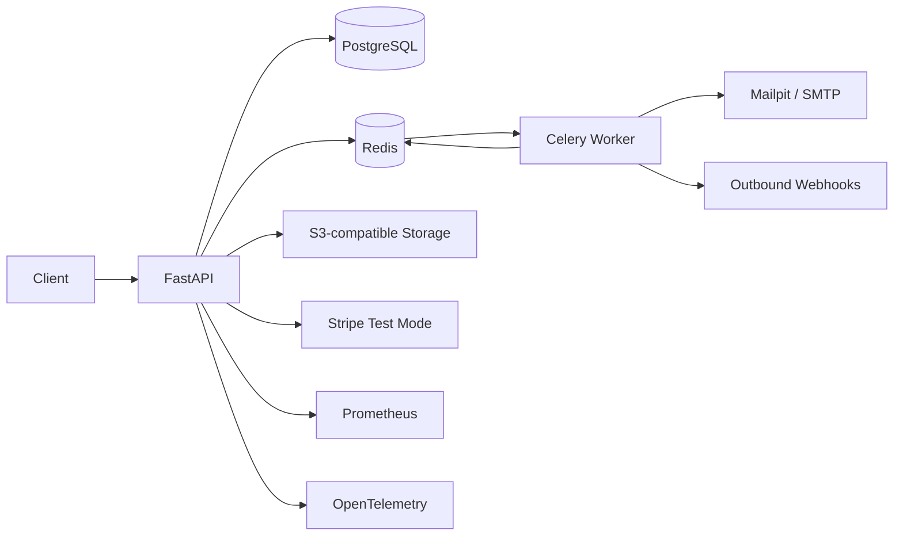

# Architecture Notes

TenantFlow is a modular monolith with a separate worker runtime. HTTP requests are handled by FastAPI. Each request receives one SQLAlchemy `AsyncSession` and an explicit transaction. Domain services flush changes; the request dependency commits only after the endpoint and dependencies complete successfully.

## Trust boundaries

- JWT proves user identity, not tenant membership. Tokens carry issuer/audience constraints and short expirations.
- Membership plus RBAC proves authorization inside an organization.
- Organization-owned queries are tenant-scoped.
- PostgreSQL constraints protect invariants that must survive application bugs or concurrent requests.
- Redis coordinates distributed rate limits and Celery work but does not own business records.
- File bytes are external objects; PostgreSQL stores tenant-scoped metadata and generated object keys.
- Outbound webhook targets are restricted to public network addresses in production to reduce SSRF exposure, and payloads are signed per endpoint.
- Webhook consumers receive event IDs and signatures and should still implement their own deduplication.
- Stripe is an external authority for payment state; webhook signatures and event IDs are verified before state synchronization.

## Transaction model

API database sessions use one transaction per request. Service functions do not call arbitrary `commit()`. This keeps cross-table writes, audit events and idempotency completion in the same transaction.

Some use cases must publish a Celery message as well as persist PostgreSQL state. The current boundary deliberately publishes before the request transaction exits so broker failure aborts the use case. Workers retry the brief pre-commit visibility race. This does not claim exactly-once behavior; [ADR 0005](adr/0005-background-publish-boundary.md) documents the trade-off and the future transactional-outbox path.

Long-running or failure-prone external calls should not be hidden inside database abstractions. If a future business flow requires stronger atomic coordination with an external system, use a transactional outbox or another explicit pattern rather than pretending PostgreSQL and Redis participate in one transaction.

## Runtime topology

The default local workflow runs the API in PyCharm/Python 3.12 while PostgreSQL, Redis, MinIO and Mailpit run in Docker Desktop. A second compose file runs the complete stack in containers for reviewers and CI-like reproduction.
